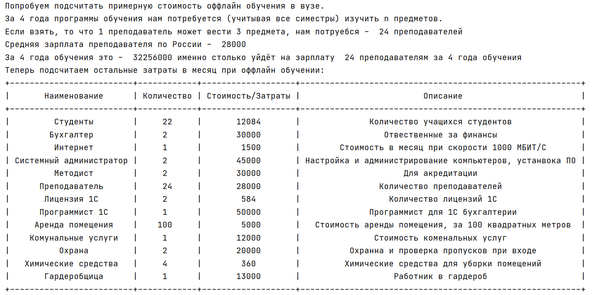

# Задача

Написать программу, рассчитывающую затраты на онлайн университет и на оффлайн университет.

На сайте ННГУ выложены ваши учебные планы - бакалавриата и магистратуры. За основу можно взять их, выкинув всякие бесполезные по вашему мнению предметы.

И конечно можно варьировать количество часов лекций и практик.

Количество студентов в группе - параметр, равный 12 или 22.

Один преподаватель ведет n пар в неделю, n = 5 или 10 ( ставка и полставки). Один преподаватель не может вести больше 3 х разных предметов.

Начисления на оплату труда 30.1 % (платит работодатель ) до вычитания подоходного налога.

Плюс оплата интернета.

Обязательно содержание двух бухгалтеров, расходы на 1С, системного администратора.

Плюс пару методистов, которые будут отбиваться от министерства образования во время проверок и аккредитации.

К оффлайн образованию прибавляем стоимость содержания здания (или аренда помещений), коммуналка, охрана, уборщица, гардеробщица, стулья столы, раз в пять лет обновление компьютеров, обновление проекторов,, закупка канцелярии, бумаги, антисептика.

Зарплаты берите средние с hh.ru

Учитывайте инфляцию, можно взять официальную, хотя реальная обычно больше.

Результатом должны стать цифры сколько каждый студент должен заплатить если учится онлайн и оффлайн. И сколько лет должен учиться. В бакалавриате и в магистратуре.

Не забывайте, что не смотря на то, что учитесь вы не весь год подряд, зарплату всем работникам нужно платить круглый год.

# Алгоритм работы 

У нас имеются 2 файла в формате json (offline, online), они содержат информацию о стоимости всех услуг.

offline - для очного обучения

online - для дистанционного обучения

Данные хранятся в виде списка массивов, где каждый имеет 4 ключа доступа:

**Name** - наименование услуги/рабочего места

**Count** - количество предоставляемых услуг/количество работников

**Salary** - стоимость услуги/зарплата для работника

**Description** - описание данной услуги

Так же реализованы 2 класса для удобного представления, хранения и работы с json

1. ObjectJson - для хранения каждого массива из json
	
	Он содержит 4 поля:
	
	1.1 Name - Название
    
	1.2 Count - Количество
    
	1.3 Salary - Стоимость/Зарплата
    
	1.4 Description - Описание
	
	Анологично ключам из json

2. Information - хранит список обьектов класса ObjectJson и реализует функцию парсинга json.
	
	Содержит всего 1 поле:
	
	2.1  ListObject - Список для хранения обьектов
	

После получения данных программа выводит в консоль текст с затратами и отображает таблицы данных.

Пример:

Для отображения подобных таблиц была использована библиотека "PrettyTable"

После вывода подробной информации в консоль и проведения расчётов по стоимости обучения, 

строится диаграмма и выводится в отдельное окно.

Данная диаграмма отображает процент затрат на все виды расходов, 

так же справа отображает таблицу с данными на основе которых строилась диаграмма.

# Участники 

Данную работу выполняли 3 студента:

	1. Бражник Дмитрий 381908-3
	
	2. Черёмушкин Кирилл 381908-3
	
	3. Козел Светлана 381908-1